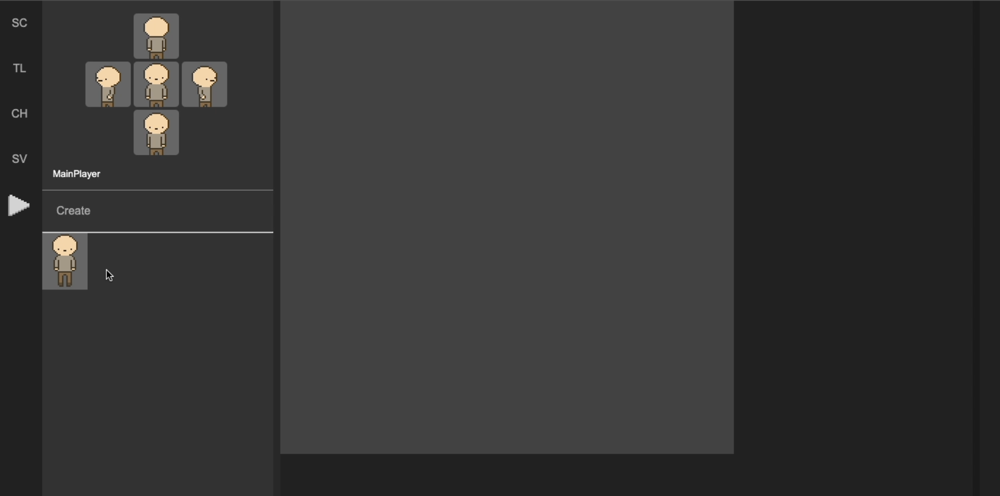
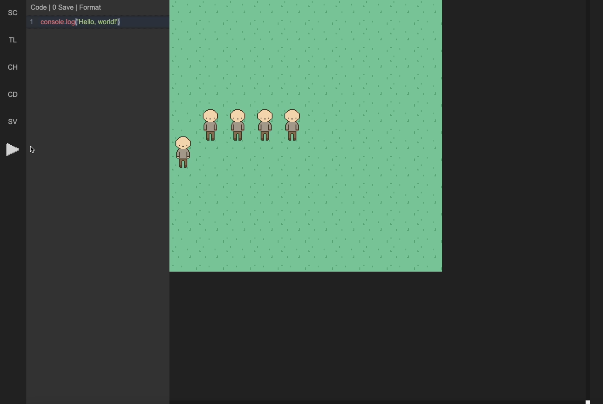
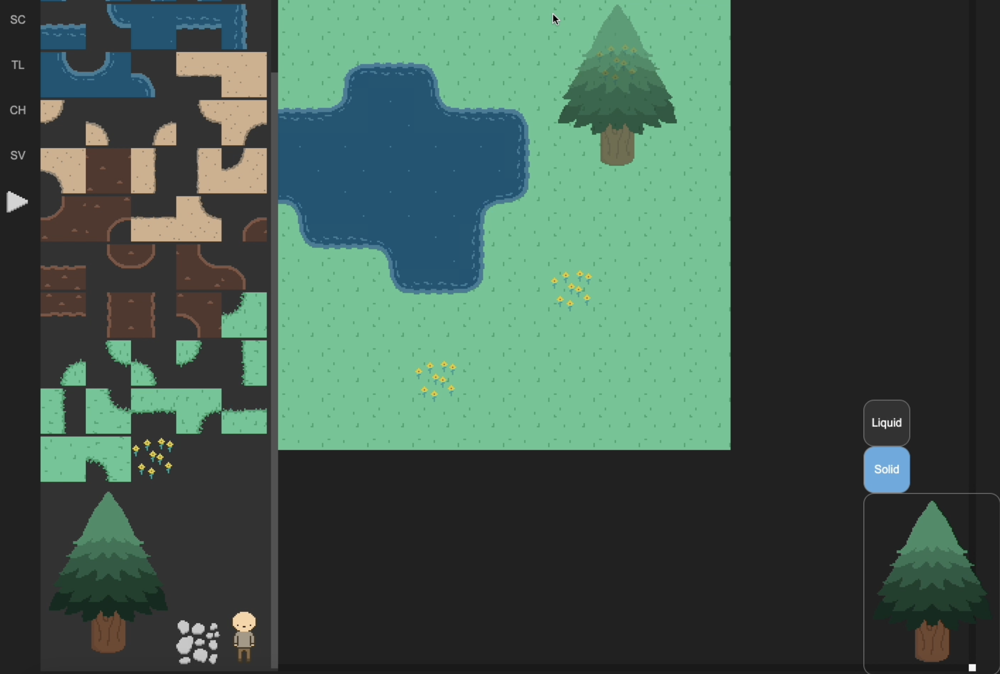

# Mushi engine

A simple visual game engine in progress where you can build your own world, set character and program those with Javascript.

Screens:

Character builder, you can push your files to define the sprites for the different directions of your player

Code editor to program the items in your world

World builder to create your scenarios.



## Project setup
```
npm install
```

### Compiles and hot-reloads for development
```
npm run serve
```

### Compiles and minifies for production
```
npm run build
```

### Lints and fixes files
```
npm run lint
```

### Customize configuration
See [Configuration Reference](https://cli.vuejs.org/config/).
